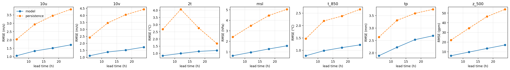
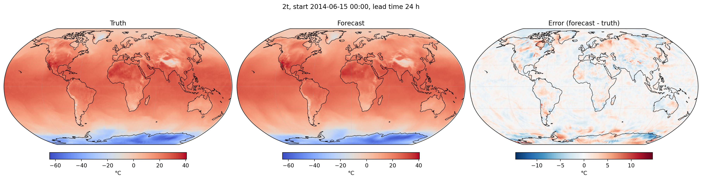

# hackathon

A workshop-scale global AI weather-forecasting experiment using Anemoi, ERA5 and a Graph Transformer, carried out by **Muhammed Muhshif Karadan** during BSC’s “Machine Learning for Earth System Modeling: the Anemoi framework”, Barcelona, 28 September–1 October 2026.

**Purpose:** gain practical experience with dataset construction, graph configuration, GPU training, autoregressive inference and forecast verification. This is a small educational experiment and a single-case evaluation, not an operational forecasting system.

## Contribution and attribution

I configured and constructed the Anemoi dataset from workshop ERA5 inputs, configured and checked the graph, configured the Graph Transformer experiment, ran smoke/benchmark/production training, ran autoregressive inference, evaluated against ERA5 truth and persistence, and produced/interpreted diagnostic figures. These activities are reported by the experiment author; recovered configs, logs and notebook support key parts of the workflow.

Anemoi was developed by its contributors, including ECMWF and partners. BSC supplied workshop templates/helpers, training context and MareNostrum 5 access. I do not claim authorship of Anemoi, ERA5, BSC infrastructure or original workshop code. See [provenance](docs/provenance.md) and [licensing status](LICENSING.md). **Workshop redistribution licensing remains unresolved; this copy is for review before public release.**

## Data and task

ERA5 workshop inputs were on a 1° × 1° regular latitude–longitude grid. The recipe covers 2010-01-01 00:00 through 2014-12-31 18:00, every six hours, and regrids by nearest neighbour to O96, an octahedral reduced Gaussian grid.

| Property | Experiment |
|---|---|
| Training | 2010–2013 |
| Internal validation and configured test | 2014 |
| 2015 | Reserved by organizers; not used for training |
| O96 points | 40,320 (author report; logged checkpoint metadata confirms coordinate-array length) |
| Dataset | 7,304 times × 48 variables (author-reported inspection) |
| Dataset size | Approximately 52.7 GiB logical, 28–29 GiB compressed (author report) |

The author reports successful initialization, 60 loading tasks, finalization/statistics and no missing data. The production store and its inspection logs are not included.

The 39 meteorological fields comprise z, q, t, u and v at 100, 250, 500, 700, 850 and 1000 hPa, plus tp, 2d, 2t, msl, sp, skt, tcw, 10u and 10v. Nine computed features are cos/sin latitude, longitude, Julian day and local time, plus insolation.

The forecast task is `[X(t−6 h), X(t)] → X̂(t+6 h)`: two input states, one six-hour prediction, training rollout one.

## Graph and model

The graph config specifies HEALPix resolution 4 (3,072 hidden nodes), cutoff factor 0.72, eight nearest neighbours for hidden-to-hidden edges and three for hidden-to-data edges. The author reports an approximately 302.8 km radius, 69,960 encoder edges, 24,576 processor edges, 120,960 decoder edges and no isolated nodes. The final graph binary/diagnostics are not available in this copy, so those diagnostic counts remain author-reported.

The recovered YAML uses 128 channels, four processor layers, eight attention heads, PyG graph attention and mixed 16-bit training. Precipitation is diagnostic, normalized by standard deviation and bounded with ReluBounding. The exact parameter count has not been verified and is omitted.

Training used 20-step smoke and 1,000-step benchmark runs before 10,000 production steps. A recovered final log explicitly reports `max_steps=10000` reached. The author reports an H100 GPU and approximately 15 min 33 s runtime on MareNostrum 5; exact runtime/GPU evidence has not been independently established here.

## Forecast and verification

Initialization: **2014-06-15 00:00 UTC**. Autoregressive prediction at +6, +12, +18 and +24 h. Evaluated fields: 10u, 10v, 2t, msl, t_850, tp and z_500. Persistence repeats the initialization state at every lead time.

The recovered notebook computes `w = cos(latitude in radians) / mean(cos(latitude))`, then `RMSE = sqrt(mean(w × (forecast − truth)²))`. On reduced O96 this cosine-latitude score differs from true cell-area weighting; it is retained to describe the original experiment faithfully. Training loss uses graph area weights separately.

The author reports: **“For this 24-hour test case, the model outperformed persistence for all evaluated variables and lead times.”** Visual inspection of the saved RMSE figure supports this comparison; numerical RMSE values have not been recomputed without the external truth dataset. No metric table is invented.

Autoregressive error growth is plausible, while the reported non-monotonic 2-m temperature persistence error may reflect the diurnal cycle. The reported smaller precipitation improvement is a case-specific observation, not a demonstrated causal conclusion. Here tp represents the preceding six-hour interval, not accumulation since forecast initialization; the author reports the corresponding inference accumulation warning.

## Limits and reproducibility

Only one initialization was evaluated, within the internal validation year. This does not establish general superiority, independent held-out test skill or operational performance. Robust verification needs multiple dates, appropriate area weighting, statistical uncertainty and confirmation of training-only normalization statistics.

No ERA5/BSC input data, Zarr stores, checkpoint, graph binaries or forecast NetCDF are distributed. Reproduction requires compatible external inputs, software, graph and weights. See [reproduction prerequisites and recovered commands](docs/reproducibility.md) and [environment evidence](environment/README.md). The cleaned workflow has not been rerun here and is not claimed to be immediately runnable on a Mac.

## Dataset availability notice

The dataset used in this experiment is not currently available in this GitHub repository. If redistribution is permitted and a suitable archive can be prepared, I intend to provide a Zenodo link in a future update. No release date is confirmed. Thank you for your understanding.

## Acknowledgements

BSC workshop organizers and instructors; MareNostrum 5 infrastructure; Anemoi contributors; ECMWF and the Copernicus Climate Change Service for ERA5. Attribution does not imply endorsement.
